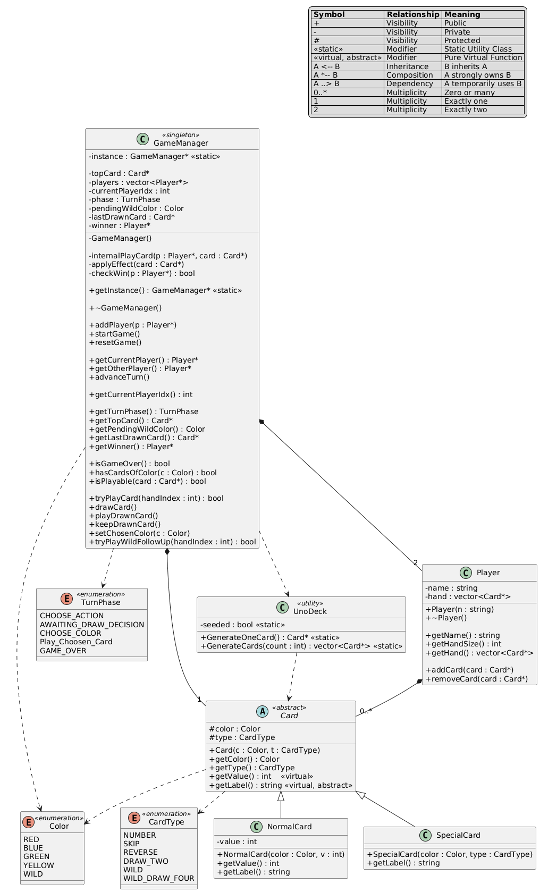

<div align="center">

# 🎴 Classic UNO

**A C++17 desktop card game inspired by UNO — built with SFML 3.0.2**


</div>

> An end-of-semester Object-Oriented Programming project.

---

## ✨ Features

- 2–4 player support with a pre-game setup screen
- Full classic ruleset: Skip, Reverse, Draw Two, Wild, Wild Draw Four
- UNO call button with a 6-card penalty for missed calls
- Infinite procedural draw pile — no fixed 108-card deck, no reshuffling
- Optional stacking/tagging house rule (toggleable)
- Custom rule: Draw Two / Wild Draw Four make the affected player draw but still take their turn
- Scoring system (number = face value, action cards = 20pts, Wild = 50pts, first to 500 wins)
- Custom-built SFML HUD, including a Wild color-picker popup

---

## 🧱 OOP Principles

This project was built specifically to demonstrate all four pillars of Object-Oriented Programming, applied deliberately rather than incidentally:

| Principle | Where it lives |
|---|---|
| **Encapsulation** | All core classes (`Card`, `Player`, `GameManager`) keep their state `private`/`protected`, exposed only through controlled getters and behavior-driven methods — no raw field access from outside. |
| **Abstraction** | `Card` is an abstract base class (`getLabel()` is pure virtual). Callers work with `Card*` without needing to know whether it's a `NormalCard` or `SpecialCard` underneath. |
| **Inheritance** | `NormalCard` and `SpecialCard` both derive from `Card`, inheriting shared color/type state while defining their own label formatting and value rules. |
| **Polymorphism** | Game logic operates entirely through `Card*` pointers and virtual dispatch — `getLabel()` and `getValue()` resolve to the correct derived-class behavior at runtime, with no type-checking branches in calling code. |

### Design Patterns
- **Singleton** — `GameManager::getInstance()` guarantees a single, globally accessible source of truth for game state and turn logic.
- **Factory Method** — `UnoDeck::GenerateOneCard()` centralizes all card creation behind one interface, so the rest of the codebase never directly constructs `NormalCard`/`SpecialCard` objects.

---

## 🏗️ Architecture

The project intentionally uses a consolidated, single-translation-unit layout rather than a one-class-per-file split — a deliberate, pragmatic choice for a project of this scope built with manual command-line compilation (no CMake):

```
├── UNO_Game.h     # All backend logic: Card hierarchy, Player, GameManager (Singleton)
├── main.cpp       # SFML frontend: rendering, input handling, screen state machine
├── assets/        # Font (Liberation Sans) and other runtime assets
└── docs/          # UML diagram and supplementary documentation
```

### UML Class Diagram



---

## 🛠️ Tech Stack

| | |
|---|---|
| **Language** | C++17 |
| **Graphics** | SFML 3.0.2 |
| **Build** | Manual command-line / MinGW (`mingw32-make`) |
| **IDE** | VS Code |

---

## 🚀 Getting Started

### Option 1 — Just play it
Grab the latest pre-built release: see the [**Releases**](../../releases) tab, download the zip, extract, and run the `.exe` — no setup required.

### Option 2 — Build from source
1. Install [SFML 3.0.2](https://www.sfml-dev.org/download/sfml/3.0.2/) and a MinGW-w64 toolchain.
2. Clone the repo:
   ```bash
   git clone https://github.com/M-Mahad-Amir/UNO-Style__Card-Game__using-SFML.git
   ```
3. Build using your Makefile / `mingw32-make`, linking against `sfml-graphics`, `sfml-window`, `sfml-system`.
4. Run the resulting executable from the project root so it can find `assets/`.

---

## 👥 Credits

Built by a 4-member team. See Contributors.

## 📄 License

This project's source code is licensed under the [MIT LICENSE](LICENSE). 
See [Notice](NOTICE) for full third-party attribution.
